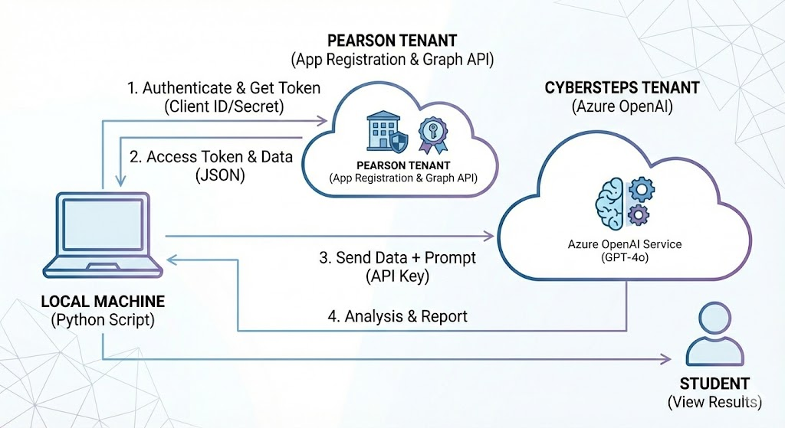
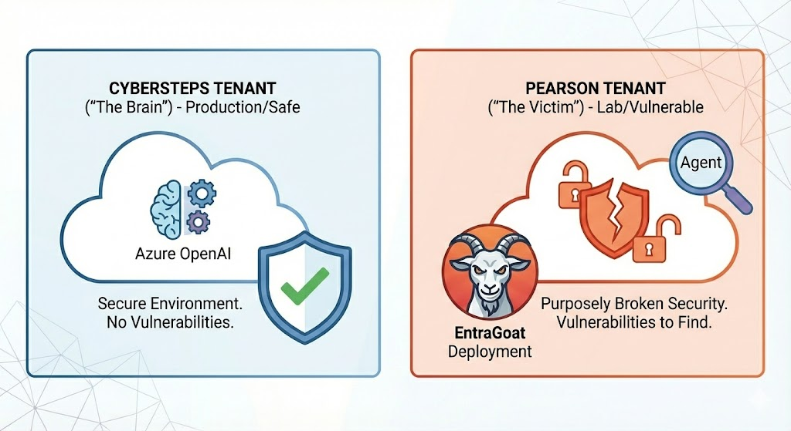

# Entra Security Agent - Architecture & Tips

This document outlines the architecture and key guidelines for the Entra ID security agent within the context of the lab environments. The implementation scripts can be found in the `entra-security-agent` directory.

## 1. Architecture and App Registration Location

This illustration shows where the key system elements are located and the role played by the **App Registration**:

* **Cybersteps (The Brain):** Contains the Azure OpenAI service. This is where the AI "thinks".
* **Pearson (The Target):** Contains the Entra ID data being audited. This is where the **App Registration** resides, acting as the "identifier" that grants access to this data.
* **Local Machine (The Bridge):** Your computer running the Python script. The script acts as a bridge, connecting independently to both clouds (the Agent in Cybersteps and the Entra Tenant in Pearson).

## 2. Communication Flow Diagram

The core mechanism relies on the fact that the **Pearson** and **Cybersteps** environments never communicate with each other directly. All traffic passes exclusively through the Python script you run:

1. The script authenticates with **Pearson** using the **Client ID** and **Secret**.
2. It receives an access token and fetches real data (e.g., a list of users or Conditional Access policies).
3. The script then sends this data, along with a crafted prompt, to the AI in **Cybersteps**.
4. Finally, it receives the analysis and report, which is then presented to the user.

## 3. The Role of EntraGoat and Tenant Security

To ensure accurate and reliable testing, the environments are strictly separated:

* **Cybersteps (Secure):** This is the production base for the AI. It remains clean and secure.
* **Pearson (Vulnerable):** This is the laboratory environment (the "proving ground"). We intentionally deploy **EntraGoat** here to introduce artificial, controlled security vulnerabilities. The deployed Agent's task is to identify these configuration risks.

## Running the Code (The Agent)

All implementation files are located in the `entra-security-agent/` directory by default.

Before running any scripts, ensure your access keys are properly configured. The environment configuration file contains variables for connecting to both environments mentioned above:

1. Locate the `.env_example` file within the folder (ready for publishing).
2. Rename it to `.env`.
3. Provide your valid authentication values for **Cybersteps** (Azure OpenAI) and **Pearson** (App Registration in Entra ID).
